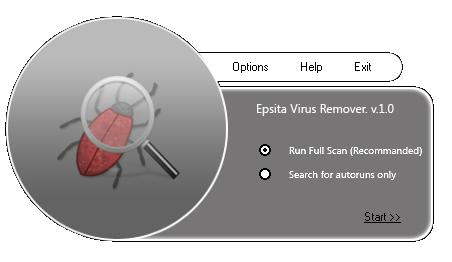



## Epsita Antivirus

### Description

There's so many antivirus code around the web. I'v seen them mosty all. But i found some lackings. so i wrote one of my. It's Epsita. I'have tasted it so many times. Althou it works on most of computers withour istalling anything. There could be some bugs in it. I'm sorry for them. I useully do not recheck my codes, i re-wright them. i'm wrighting another antivirus with commercial options now so i'm so busy now. please use the code as u want to. vote me if u liked it. Please inspiret me to do some more good works.

###*** Be care full, This app will delete all your autostartup function ex: run, run once. ***###

** There is a fixed and re-writed code "PainKiller" please see this submission of my to have a better one. i had ramoved all of those bugs from it, it dont delete your registry**
 
### More Info
 

             |
---                |---
**Submitted On**   |2008-05-13 15:14:12
**By**             |[Ratul Ahmed](https://github.com/Planet-Source-Code/PSCIndex/blob/master/ByAuthor/ratul-ahmed.md)
**Level**          |Intermediate
**User Rating**    |4.0 (16 globes from 4 users)
**Compatibility**  |VB 6\.0
**Category**       |[Miscellaneous](https://github.com/Planet-Source-Code/PSCIndex/blob/master/ByCategory/miscellaneous__1-1.md)
**World**          |[Visual Basic](https://github.com/Planet-Source-Code/PSCIndex/blob/master/ByWorld/visual-basic.md)
**Archive File**   |[Epsita\_Ant21314110212008\.zip](https://github.com/Planet-Source-Code/ratul-ahmed-epsita-antivirus__1-71270/archive/master.zip)

